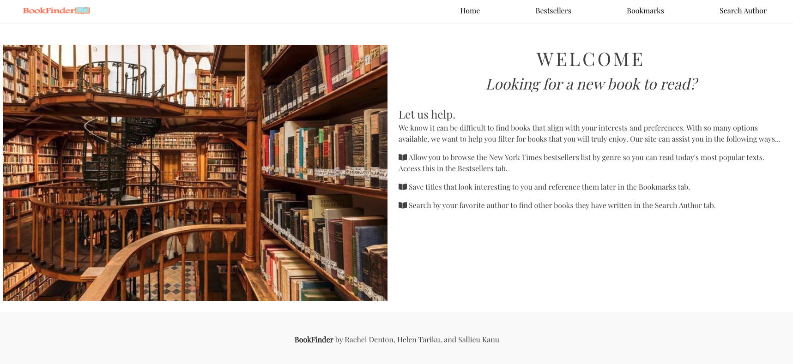
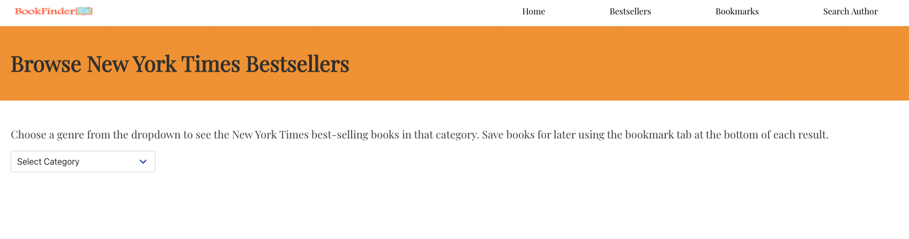
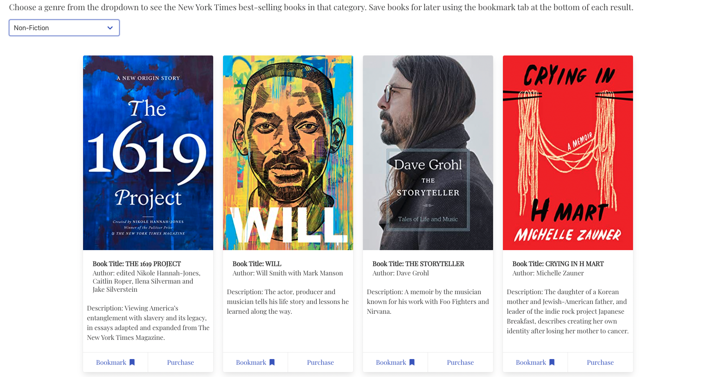
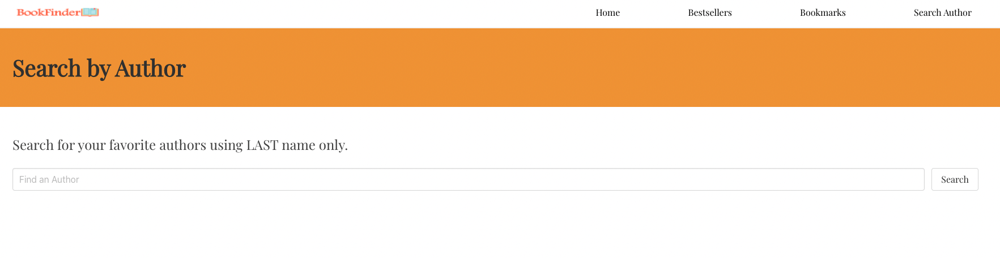
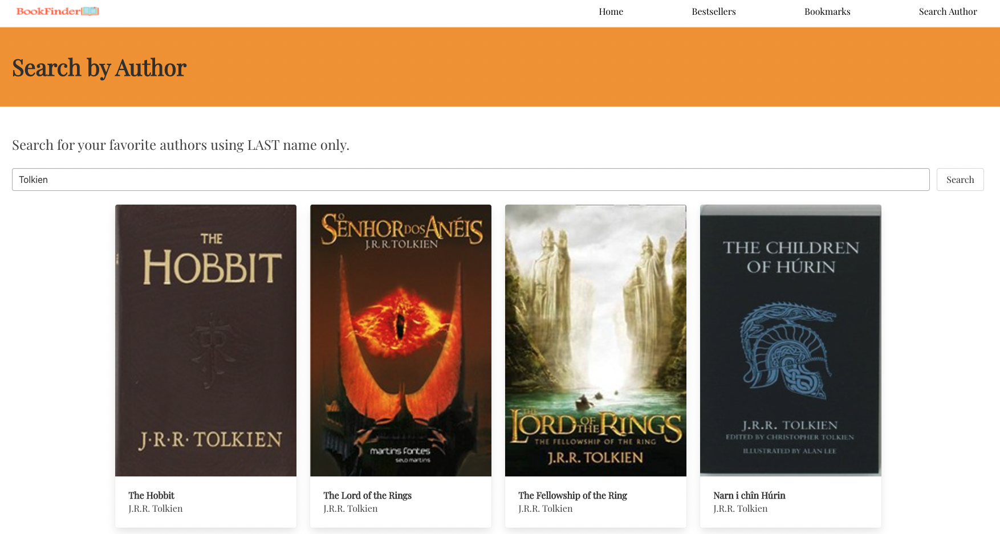
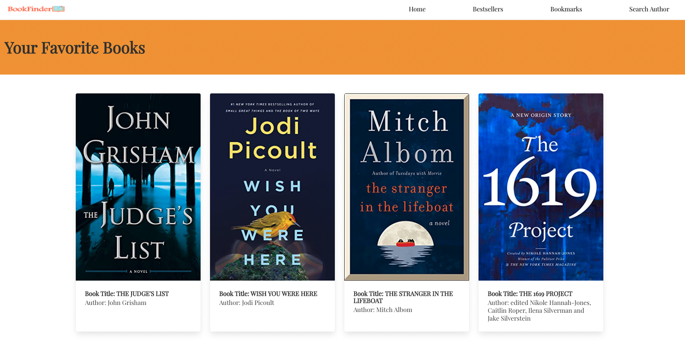

# BookFinder API 

## Description
Often times active readers struggle to get a hold of the next book to read.

BookFinder allows readers to browse through their favorite authors and titles to find their next page turner with just the click of a button. 

## User Story
AS AN active book reader
I WANT to easily find new books that match my preferences
SO THAT I can spend more time reading interesting books and less time searching for them

## Functionality
WHEN I  browse bestsellers
THEN I can filter by genres I am interested in
WHEN I  see an interesting book
THEN I can save it and reference it later
WHEN I  want to find other books by    my favorite author
THEN I can search by author name    and see all their published books

## Built With
* HTML
* CSS
* Bulma
* JavaScript
* jQuery
* New York Times API
* OpenLibrary API

## Website Link
https://rdenton3.github.io/book-finder/ 

## Photos

